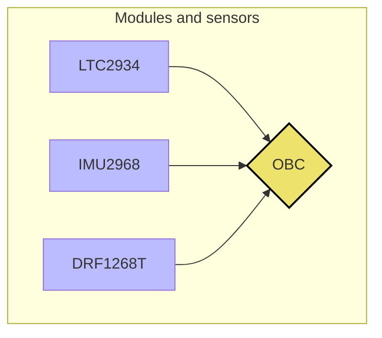
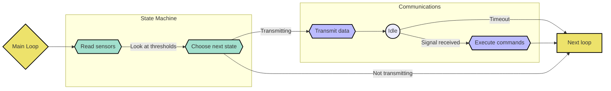

# STA's PocketQube
### Python repository

Development repository for our PocketQube-project.

## How to use

Put contents of lib-folder into lib-folder of E:\CIRCUITPYTHON drive on your board. 
Put code.py into root folder.

## Architecture

  

## States

#### Idle

> Threshold to Enter

No others met.

> Functions
* Log sensors & state
* Reading all sensors

#### LowPower

> Threshold to enter

Certain voltage reached.

> Functions
* Log state
* Read only critical sensors

#### Comms

> Threshold to enter

Antenna having received signal.

> Functions
* Receive commands
* Log sensors & state
* Transmit log

## TODO

> Encoding for Comms

> Command Parsing

> ~~API for analogueIn devices~~

> ~~State Machine & Power modes~~

> Non intrusive Exception handling that ensures stable runtime

> Globally updated log to downlink, log == stdout?

> Testing of libraries for external modules
